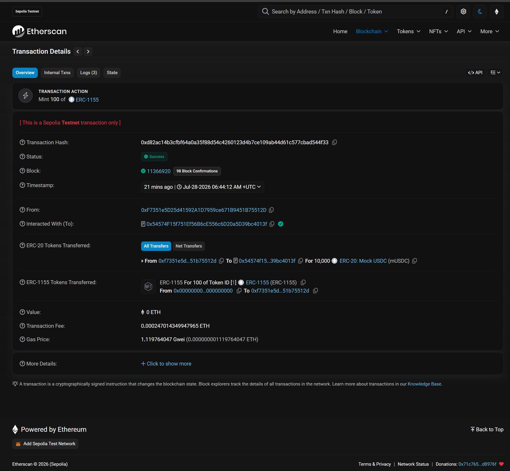
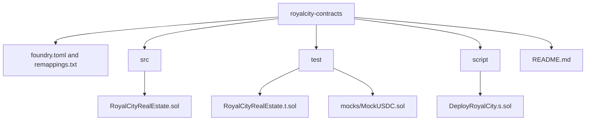
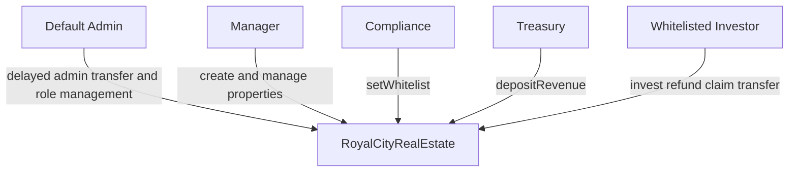
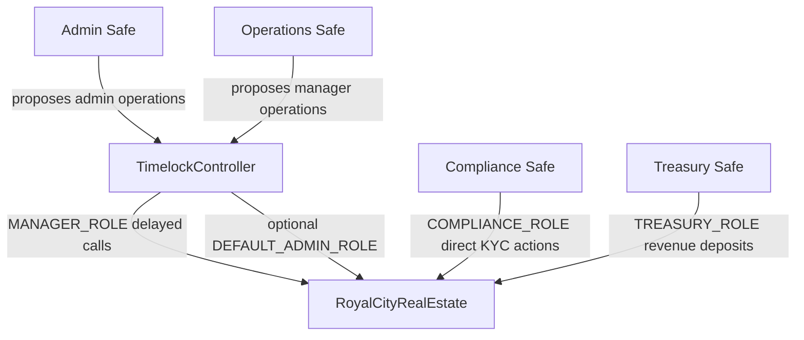
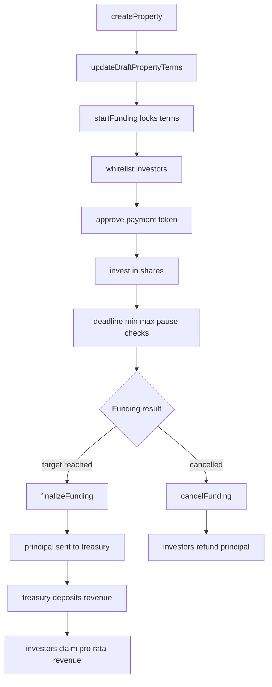

## RoyalCity Contracts

RoyalCity Contracts is a Foundry-based MVP for tokenized real estate investment flows. It is designed as a testnet-ready and audit-friendly starting point for a small team, not as a finished production RWA system.

## Deployed on Sepolia (testnet rehearsal)

| Contract | Address | Explorer |
|----------|---------|----------|
| MockUSDC | `0xDf5fA05Eb22B2B68a7178d325E3b8b6027F6C0D1` | [Etherscan](https://sepolia.etherscan.io/address/0xdf5fa05eb22b2b68a7178d325e3b8b6027f6c0d1) |
| RoyalCityRealEstate | `0x54574F15f751Ef56B6cE556c6D20a5D39bc4013f` | [Etherscan](https://sepolia.etherscan.io/address/0x54574f15f751ef56b6ce556c6d20a5d39bc4013f) |

**Network:** Ethereum Sepolia (chain ID `11155111`)

**Demo flow:** property `#1` created → funding started → investor whitelisted → **100 shares invested** (10,000 mUSDC).

| Step | Transaction |
|------|-------------|
| Deploy RoyalCity | [0x2230…5768a](https://sepolia.etherscan.io/tx/0x223080b2b2d9b2299e0a9eef49fa4a3a05e4944eacc2321182b5093e0ef5768a) |
| Create property #1 | [0x8389…a843](https://sepolia.etherscan.io/tx/0x83891160e369ab3a8a09e727bc0998b9491aaf3ef27a55e934952de0aea8a843) |
| **Invest 100 shares** | **[0xd82a…4f33](https://sepolia.etherscan.io/tx/0xd82ac14b3cfbf64a0a35f88d54c4260123d4b7ce109ab44d61c577cbad544f33)** |



To reproduce locally, copy [`env.sample`](env.sample) to `.env` and follow the deployment section below.

## What It Implements

- One ERC1155-based contract manages many properties.
- Each `propertyId` represents the shares for one real estate asset.
- Investors pay a fixed ERC20 payment token, such as USDC, to buy property shares.
- Only whitelisted investors can buy, receive transferred shares, and claim revenue.
- A property moves through `Draft`, `Funding`, `Funded`, `Cancelled`, and `Closed`.
- Each property has a funding deadline, minimum investment, maximum per-investor investment, and per-property pause switch.
- Cancelled funding rounds allow investors to refund their principal.
- Funded properties can receive revenue deposits and distribute them pro rata by share balance.
- Admin, manager, compliance, and treasury permissions are separated with OpenZeppelin access control.
- The default admin uses a delayed two-step transfer flow via `AccessControlDefaultAdminRules`.

## Production Skeleton Map

The map below is intentionally broad rather than deeply detailed. It shows the production-grade modules RoyalCity needs to cover before real funds are involved.

```text
┌──────────────────────────────────────────────────────────────────────────────┐
│                              RoyalCity Protocol                              │
│                    Tokenized real estate investment system                    │
└──────────────────────────────────────────────────────────────────────────────┘

                                      │
                                      ▼

┌──────────────────────────────┐     ┌──────────────────────────────┐
│  G1. Governance Layer        │     │  G2. Operations Layer        │
│  - Safe multisigs            │────▶│  - manager actions           │
│  - TimelockController        │     │  - property lifecycle        │
│  - delayed default admin     │     │  - emergency response        │
└──────────────────────────────┘     └──────────────────────────────┘
              │                                      │
              │ delayed privileged calls             │ create/update/pause/finalize
              ▼                                      ▼
┌──────────────────────────────────────────────────────────────────────────────┐
│                         RoyalCityRealEstate.sol                              │
│                                                                              │
│  ┌──────────────────────┐   ┌──────────────────────┐   ┌──────────────────┐ │
│  │ P1. Property Registry │   │ P2. Investment Rules  │   │ P3. Share Token  │ │
│  │ - metadata URI        │   │ - whitelist required  │   │ - ERC1155 shares │ │
│  │ - lifecycle state     │   │ - deadline            │   │ - per propertyId │ │
│  │ - draft term updates  │   │ - min/max investment  │   │ - transfer gate  │ │
│  └──────────────────────┘   └──────────────────────┘   └──────────────────┘ │
│                                                                              │
│  ┌──────────────────────┐   ┌──────────────────────┐   ┌──────────────────┐ │
│  │ F1. Funding Vault     │   │ R1. Revenue Engine    │   │ E1. Exit Layer   │ │
│  │ - collect USDC        │   │ - revenue deposits    │   │ - refund path    │ │
│  │ - finalize principal  │   │ - reward per share    │   │ - close property │ │
│  │ - cancelled refunds   │   │ - claim revenue       │   │ - future redeem  │ │
│  └──────────────────────┘   └──────────────────────┘   └──────────────────┘ │
│                                                                              │
│  ┌──────────────────────┐   ┌──────────────────────┐   ┌──────────────────┐ │
│  │ C1. Compliance Gate   │   │ S1. Safety Controls   │   │ A1. Audit Surface│ │
│  │ - whitelist           │   │ - global pause        │   │ - events         │ │
│  │ - role separation     │   │ - property pause      │   │ - invariants     │ │
│  │ - future KYC tiers    │   │ - reentrancy guard    │   │ - runbooks       │ │
│  └──────────────────────┘   └──────────────────────┘   └──────────────────┘ │
└──────────────────────────────────────────────────────────────────────────────┘

                                      │
                                      ▼

┌──────────────────────────────┐     ┌──────────────────────────────┐
│  I1. Indexing / Backend      │     │  I2. Frontend / Wallet UX    │
│  - listen to events          │────▶│  - connect wallet            │
│  - sync investment records   │     │  - approve payment token     │
│  - expose property data      │     │  - invest/refund/claim       │
└──────────────────────────────┘     └──────────────────────────────┘

                                      │
                                      ▼

┌──────────────────────────────────────────────────────────────────────────────┐
│                         Off-chain Production Requirements                     │
│  - legal entity and asset ownership documents                                 │
│  - KYC / AML provider                                                         │
│  - treasury accounting                                                         │
│  - independent smart contract audit                                            │
│  - deployment checklist and incident response plan                             │
└──────────────────────────────────────────────────────────────────────────────┘
```

Legend:

- `G*`: governance and operations ownership.
- `P*`: property and share-accounting modules.
- `F*`: funding and principal flow.
- `R*`: revenue distribution.
- `E*`: exits, refunds, redemption, and liquidation paths.
- `C*`: compliance controls.
- `S*`: safety controls.
- `A*`: audit and verification surface.
- `I*`: integration with backend, indexers, and frontend.

## Project Structure



## Files

- `src/RoyalCityRealEstate.sol`: Main ERC1155 property share contract.
- `test/RoyalCityRealEstate.t.sol`: Core behavior tests.
- `test/RoyalCityInvariant.t.sol`: Invariant tests for funding accounting.
- `test/RoyalCityTimelock.t.sol`: Timelock/Safe-style governance tests.
- `test/mocks/MockUSDC.sol`: Local 6-decimal ERC20 payment token for tests.
- `script/DeployRoyalCity.s.sol`: Deployment script.
- `script/DeployRoyalCityTimelock.s.sol`: Timelock deployment script.
- `script/ConfigureRoyalCityGovernance.s.sol`: Role migration and default-admin transfer starter.
- `script/ScheduleRoyalCityAdminAcceptance.s.sol`: Schedules Timelock acceptance of default admin.
- `script/ExecuteRoyalCityAdminAcceptance.s.sol`: Executes Timelock acceptance after delays pass.
- `foundry.toml`: Foundry configuration.
- `remappings.txt`: Dependency remappings.

## Roles

- `DEFAULT_ADMIN_ROLE`: Can pause/unpause and manage roles. It uses delayed two-step transfer rules.
- `MANAGER_ROLE`: Can create properties, start/cancel/finalize funding, and close properties.
- `COMPLIANCE_ROLE`: Can add or remove whitelist status.
- `TREASURY_ROLE`: Can deposit revenue.

The constructor sets the deployer as the initial default admin with a configurable admin transfer delay. It also grants manager and compliance roles to the deployer, and treasury role to the configured treasury address.



## Governance Architecture

RoyalCity does not implement its own multisig. Production deployments should use Safe wallets and OpenZeppelin `TimelockController`:



Recommended production ownership:

- `DEFAULT_ADMIN_ROLE`: Timelock or Admin Safe, depending on governance maturity.
- `MANAGER_ROLE`: Timelock, with an operations Safe as proposer/canceller.
- `COMPLIANCE_ROLE`: Compliance Safe, because KYC updates may need operational speed.
- `TREASURY_ROLE`: Treasury Safe.

The Timelock pattern means a Safe proposes a privileged action, waits `TIMELOCK_DELAY`, then an executor performs it. This gives the team time to detect and cancel mistakes before execution.

## Core Flow

1. Manager creates a property with total shares, share price, funding target, min/max investment, deadline, and metadata URI.
2. While the property is still `Draft`, manager can correct terms with `updateDraftPropertyTerms`.
3. Manager starts funding. Terms become locked after this point.
4. Compliance whitelists eligible investors.
5. Investors approve USDC and call `invest(propertyId, shares)`.
6. The contract rejects expired funding, below-minimum investments, above-maximum cumulative investments, and paused properties.
7. If funding succeeds, manager calls `finalizeFunding`, which sends principal to treasury.
8. Treasury deposits rental or other revenue with `depositRevenue`.
9. Investors call `claimRevenue` to receive their pro rata revenue.
10. If funding is cancelled before finalization, investors call `refund`.



## Commands

Install dependencies and run tests:

```shell
forge test
```

Format Solidity files:

```shell
forge fmt
```

Build contracts:

```shell
forge build
```

Run only invariant tests:

```shell
forge test --match-contract RoyalCityInvariantTest
```

### Environment setup

Copy [`env.sample`](env.sample) to `.env` and fill in your values. Foundry loads `.env` from the project root when running scripts.

```shell
cp env.sample .env
```

Required for the default testnet flow:

- `PRIVATE_KEY` — deployer key with `0x` prefix
- `RPC_URL` — e.g. Sepolia Infura URL
- `TREASURY` — treasury/deployer address
- `PAYMENT_TOKEN` — set after `DeployMockUSDC`
- `ROYALCITY_CONTRACT` — set after `DeployRoyalCity`

Deploy MockUSDC (testnet payment token):

```shell
forge script script/DeployMockUSDC.s.sol:DeployMockUSDC --fork-url $RPC_URL --broadcast -vvvv
```

Deploy:

```shell
PRIVATE_KEY=<deployer_private_key> \
PAYMENT_TOKEN=<usdc_or_payment_token_address> \
TREASURY=<treasury_address> \
BASE_URI="ipfs://royalcity/{id}.json" \
DEFAULT_ADMIN_DELAY=172800 \
forge script script/DeployRoyalCity.s.sol:DeployRoyalCity --rpc-url <rpc_url> --broadcast --verify
```

Deploy Timelock:

```shell
PRIVATE_KEY=<deployer_private_key> \
TIMELOCK_DELAY=172800 \
TIMELOCK_PROPOSER_SAFE=<safe_or_operations_multisig> \
TIMELOCK_EXECUTOR=0x0000000000000000000000000000000000000000 \
TIMELOCK_TEMP_ADMIN=0x0000000000000000000000000000000000000000 \
forge script script/DeployRoyalCityTimelock.s.sol:DeployRoyalCityTimelock --rpc-url <rpc_url> --broadcast --verify
```

Configure RoyalCity roles:

```shell
PRIVATE_KEY=<current_default_admin_private_key> \
ROYALCITY_CONTRACT=<royalcity_contract_address> \
TIMELOCK=<timelock_address> \
COMPLIANCE_SAFE=<compliance_safe_address> \
TREASURY_SAFE=<treasury_safe_address> \
DEFAULT_ADMIN_TARGET=<timelock_or_admin_safe_address> \
REVOKE_DEPLOYER_MANAGER=false \
REVOKE_DEPLOYER_COMPLIANCE=false \
forge script script/ConfigureRoyalCityGovernance.s.sol:ConfigureRoyalCityGovernance --rpc-url <rpc_url> --broadcast
```

If `DEFAULT_ADMIN_TARGET` is the Timelock, schedule and execute Timelock acceptance after both the RoyalCity admin delay and Timelock delay have passed:

```shell
PRIVATE_KEY=<timelock_proposer_private_key> \
TIMELOCK=<timelock_address> \
ROYALCITY_CONTRACT=<royalcity_contract_address> \
TIMELOCK_DELAY=172800 \
forge script script/ScheduleRoyalCityAdminAcceptance.s.sol:ScheduleRoyalCityAdminAcceptance --rpc-url <rpc_url> --broadcast
```

```shell
PRIVATE_KEY=<executor_private_key> \
TIMELOCK=<timelock_address> \
ROYALCITY_CONTRACT=<royalcity_contract_address> \
forge script script/ExecuteRoyalCityAdminAcceptance.s.sol:ExecuteRoyalCityAdminAcceptance --rpc-url <rpc_url> --broadcast
```

On PowerShell, set environment variables first:

```powershell
$env:PRIVATE_KEY="<deployer_private_key>"
$env:PAYMENT_TOKEN="<usdc_or_payment_token_address>"
$env:TREASURY="<treasury_address>"
$env:BASE_URI="ipfs://royalcity/{id}.json"
$env:DEFAULT_ADMIN_DELAY="172800"
forge script script/DeployRoyalCity.s.sol:DeployRoyalCity --rpc-url <rpc_url> --broadcast --verify
```

## Deployment Runbook

Use this runbook for testnet rehearsals before any production deployment.

1. Pick the network and payment token.
   - Confirm the ERC20 decimals and transfer behavior.
   - For USDC-like assets, verify the token address from the official issuer or chain explorer.
2. Prepare operational wallets.
   - Use a Safe multisig for admin and treasury roles.
   - Avoid leaving `DEFAULT_ADMIN_ROLE` on a personal deployer wallet after setup.
3. Deploy the RoyalCity contract.
   - Set `PRIVATE_KEY`, `PAYMENT_TOKEN`, `TREASURY`, `BASE_URI`, and `DEFAULT_ADMIN_DELAY`.
   - Use a non-zero `DEFAULT_ADMIN_DELAY` for production rehearsals. The examples use `172800` seconds.
   - Run the deploy script with `--broadcast`.
   - Verify the contract on the chain explorer.
4. Deploy Timelock.
   - Set proposer to the operations/admin Safe.
   - Use open executor `address(0)` or a dedicated executor bot wallet.
   - Avoid temporary admin unless you need a controlled setup window.
5. Assign roles.
   - Grant `MANAGER_ROLE` to the Timelock.
   - Grant `COMPLIANCE_ROLE` to the KYC operations wallet.
   - Grant `TREASURY_ROLE` to the treasury multisig if it differs from constructor input.
   - Start default admin transfer to the Timelock or admin multisig with `beginDefaultAdminTransfer`.
   - If transferring to Timelock, schedule `acceptDefaultAdminTransfer` through Timelock after RoyalCity's `defaultAdminDelay` has passed.
   - Execute the scheduled acceptance after Timelock's own delay has passed.
   - Revoke deployer manager/compliance roles after confirming multisig access.
6. Create the first property.
   - Confirm `totalShares * sharePrice` covers the funding target.
   - Set a realistic `fundingDeadline`.
   - Set `minInvestment` and `maxInvestment` according to business and compliance limits.
   - Use `updateDraftPropertyTerms` for corrections before funding starts.
   - Review the metadata URI and off-chain property documents before `startFunding`.
7. Rehearse investor flows on testnet.
   - Whitelist test investors.
   - Approve payment token.
   - Invest within limits.
   - Test expired funding, paused property, cancellation, refund, finalization, revenue deposit, and claim.
8. Before mainnet.
   - Run the full test suite and invariant tests.
   - Complete independent audit and fix review findings.
   - Freeze deployment parameters in an internal release checklist.
   - Document emergency contacts, pause policy, and treasury procedures.

## Security Notes

This MVP keeps the on-chain design intentionally conservative:

- Transfers require both sender and receiver to be whitelisted.
- Transfers are only allowed after a property is `Funded` or `Closed`.
- Global `pause` and per-property pause block investing, transfers, and revenue deposits, but refunds and claims are left available to reduce stuck-fund risk.
- Funding deadlines and min/max investment limits are enforced on-chain.
- Property terms can only be changed while the property is `Draft`; once funding starts, terms are locked.
- Default admin ownership uses a delayed two-step transfer instead of direct `grantRole`.
- `MANAGER_ROLE` should be assigned to Timelock for production so create/cancel/finalize/pause operations are delayed.
- Revenue accounting uses cumulative revenue per share and does not iterate through all investors.
- External ERC20 movements use `SafeERC20` and mutating fund flows use `nonReentrant`.

Before any production launch with real funds, the team should complete:

- Legal and compliance review for RWA/security-token obligations.
- Third-party smart contract audit.
- Deployment rehearsal on a public testnet.
- Multisig setup for admin, manager, compliance, and treasury roles.
- Monitoring and incident response procedures.
- Clear off-chain policy for KYC, investor eligibility, property documents, revenue source, and investor disclosures.
